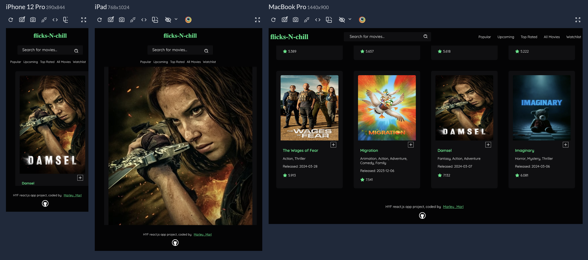

# flicks-N-chill React movie app

This is a project built as part of the Hack Your Future bootcamp React module.

## Table of contents

- [Overview](#overview)
  - [Features](#Features)
  - [Screenshot](#site-view-on-different-screen-sizes)
  - [Links](#links)
- [My process](#my-process)
  - [Tools Used](#tools-used)
  - [Continued development](#continued-development)
  - [Useful resources](#useful-resources)


## Overview
A movie discovery web application built with React.js. The app allows a user to browse popular, upcoming, and top-rated movies, add movies to their watchlist, and view detailed information about each movie.

### Features

- A user is able to:
  - Browse popular movies, upcoming movies and top rated movies
  - Search for  movies by title
  - Add and delete movies to and from the watchlist
  - Click on a movie card to see more detailed information on a separate movie page

### Site View on different screen sizes




### Links

- View code: [Repository](https://github.com/Marley-Semende/react-movie-app)
- Live Demo: [LiveSite URL](https://marley-marl-movie-app.netlify.app/)

## My process

### Tools Used

- [React](https://reactjs.org/) 
- [Vite](https://vitejs.dev/) 
- [Axios](https://axios-http.com/docs/intro)
- [React Toastify](https://www.npmjs.com/package/react-toastify)
- [React Router](https://reactrouter.com/en/main)
- [Responsively](https://responsively.app/)
- [iconPark](https://iconpark.oceanengine.com/official)
- CSS
- Mobile-first workflow


### Continued development

In the near future I plan to add more features to this project including, light and dark theme toggle, local storage, user sign up.

### Useful resources

- [HYF Curriculum](https://github.com/hackyourfuture/curriculum) 
- [Scrimba React Course](https://scrimba.com/learn/learnreact) 


### To run the project:

```bash
git  clone  https://github.com/Marley-Semende/react-movie-app.git              

```

```bash
npm install 
```

```bash
npm run dev
```


